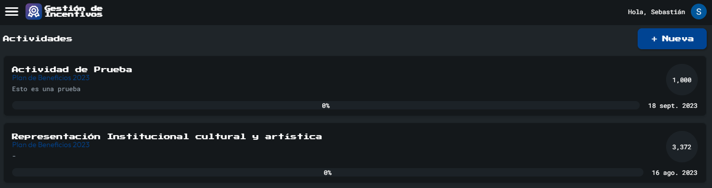
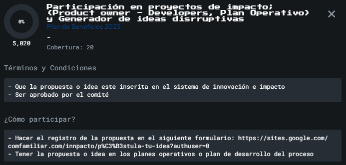
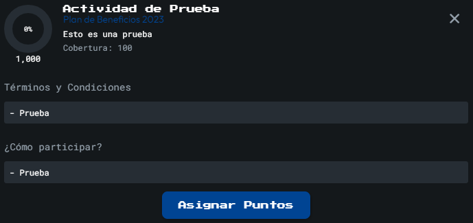
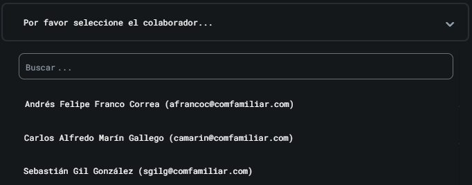
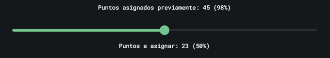
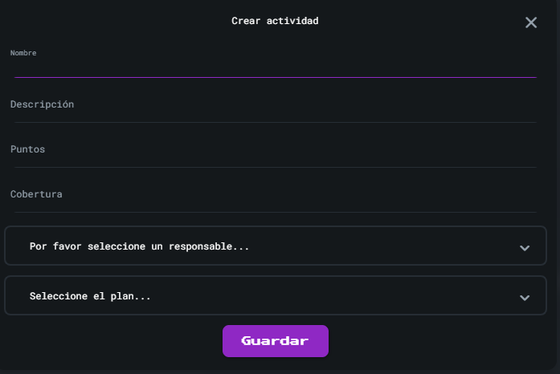

Esta sección muestra el nombre de las actividades inscritas al plan actual en las cuales los usuarios podrán participar. También es posible visualizar la cantidad de puntos totales de cada actividad, el porcentaje de esos puntos que ha sido asignado y la fecha de creación de cada actividad. 

Además, al dar click sobre una actividad se muestra una visual que contiene información adicional como los términos y condiciones, y la forma correcta de participación.

### Menú ☰
Este icono esta ubicado en la parte superior izquierda, y es un link directo al **[Menú](Menu)**

### Opciones de Cuenta 👤
Este icono esta ubicado en la parte superior derecha, y es un link directo al **[Opciones de Cuenta](Cuenta)**

### Usuario Responsable de Actividades
Como se mencionó, al dar click sobre una actividad se muestra una visual que contiene información adicional como los términos y condiciones, y la forma correcta de participación. Además, si es un usuario **Responsable de Actividades** se habilitará en esta visual un botón de **Asignar Puntos**. Couando se da click en este botón se muestra la siguiente ventana: 

En esta nueva ventana se muestra nuevamente la información relacionada con la actividad como el nombre, el plan y los puntos. Además, se muestran elementos que permiten realizar la asignación de puntos a los colaboradores: 

#### Despleglable de colaboradores
Este elemento permite seleccionar el nombre del colaborador al cual se le va a asignar puntos. Tiene la opción de buscar por nombre o por correo con el fin de facilitar la búsqueda. Al seleccionar un colaborador, se muestra bajo el menú despleglable la cantidad de puntos que le han sido asignados previamente para esta actividad y el porcentaje correspondiente. Esto es útil ya que si por ejemplo se han asignado previamente el 80% de los puntos, se sabe que máximo se podrá otorgar el 20% en esta asignación.

#### Barra puntos
Este elemento permite selccionar la cantidad de puntos que serán asignados. 

#### Comentario
En este elmento se ingresan los comentarios que sean requeridos en las asignaciones. Este no es un campo obligatirio.

#### Botón de Guardar
Permite almacenar la transacción realizada, teniendo en cuenta la actividad, el colaborador, los puntos asignados y el comentario.

### Usuario de Gestión Humana

Si es un usuario de GH se habilitará el boton "**Nuevo**" que abre la siguiente ventana para crear actividades:

  

Esta visual permite editar el nombre de la actividad, la descripción, los puntos (cantidad total de puntos disponibles para la actividad), la cobertura (cantidad de colaboradores que participarán en la actividad), el colaborador responsable de la actividad y el plan al cual pertenecerá la actividad.