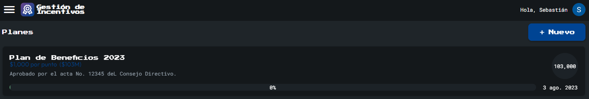
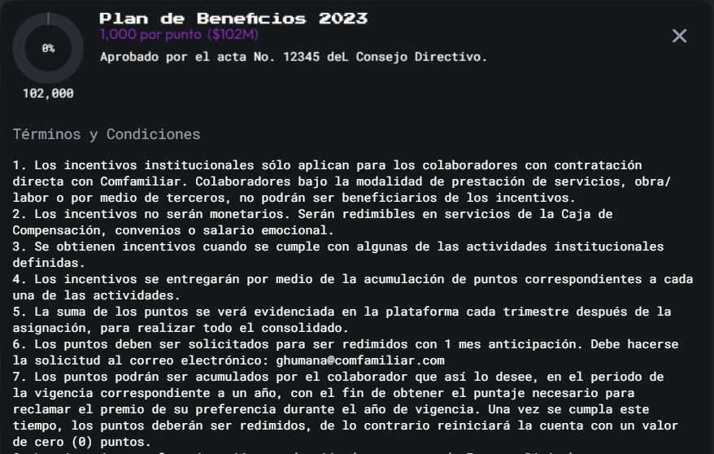
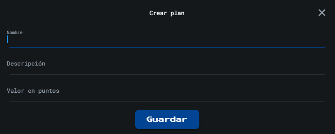

Esta sección muestra una descripción del plan de beneficios vigente que incluye el nombre del plan, puntos totales, porcentaje de puntos asignado y fecha de creación. Si se da click sobre el plan es posible ver información adicional como los términos y condiciones.

### Menú ☰
Este icono esta ubicado en la parte superior izquierda, y es un link directo al **[Menú](Menu)**

### Opciones de Cuenta 👤
Este icono esta ubicado en la parte superior derecha, y es un link directo al **[Opciones de Cuenta](Cuenta)**

### Usuario de Gestion Humana
Si es un usuario de GH se habilitará el boton "**Nuevo**" que abre la siguiente ventana para crear planes:

Esta visual permite editar el nombre del plan, la descripción y el valor en puntos (a cuantos pesos equivale cada punto)